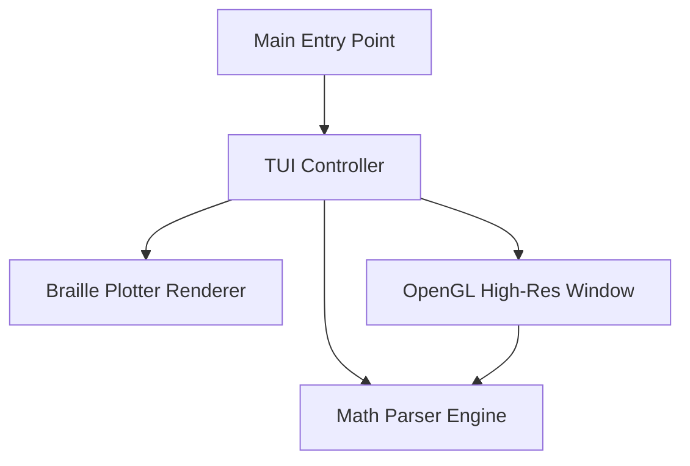

# graphcalc

WIP

# Introduction
Graphcalc is a personal University project that I am working on. It combines skills from various modules that I am doing in my second year.
Its aim is to map complex graphs and find various statistics about them.

## Key Goals
* A simple and clear to use interface 
* Efficient memory and resource management
* Modular and extendable

# Installation

## Linux

Make sure you have these dependencies installed:
* CMake
* Ninja

Then clone the repository
```
git clone https://github.com/msxshankar/graphcalc
cd graphcalc
```

Build using CMake and Ninja
```
cmake -DCMAKE_BUILD_TYPE=Debug -DCMAKE_MAKE_PROGRAM=ninja -G Ninja -S . -B build
cd build && ninja
```
Finally, run the program
```
./graphcalc
```

## Building and Running

### Prerequisites

For standard terminal-only mode, any standard GCC compiler supporting C++17 is sufficient.
For the high-resolution OpenGL visualization window, you will need the X11 and OpenGL development libraries installed:
```bash
sudo apt-get install -y libx11-dev libgl-dev libglu1-mesa-dev
```

### Compiling with Make

Build the optimized release binary directly using the provided `Makefile`:

```bash
make clean && make
```

### Running the Application

Start the interactive TUI shell:

```bash
./graphcalc
```

To run with command line flags:
- `./graphcalc --help` or `-h`: Shows command usage instructions.
- `./graphcalc --version` or `-v`: Shows the software version details.

### Keyboard & Interaction Controls

* **Main TUI Navigation:**
  * `Left / Right Arrow`: Switch categories (2D, 3D, and Visuals).
  * `Up / Down Arrow`: Browse template equations in the selected category.
  * `[` / `]`: Scroll long mathematical or historical descriptions vertically in the sidebar.
  * `C`: Enter a custom equation (e.g., `sin(x) * cos(y)`).
  * `Enter`: Confirm selection and open the visualization mode menu.
  * `Q` / `Esc`: Close input prompts, go back, or exit the program.
* **Interactive Simulation Controls:**
  * `A / Z`: Increment/decrement coefficient `a`.
  * `S / X`: Increment/decrement coefficient `b`.
  * `D / C`: Increment/decrement coefficient `c`.
  * `Space`: Play or pause time-based animation (`t`).
  * `R`: Reset coefficients and viewpoints to default.
  * `Mouse Drag` (Terminal & OpenGL): Rotate 3D plots or pan 2D plots.
  * `Mouse Scroll` (OpenGL only): Zoom in/out.

### Running Automated E2E Tests

To run the complete suite of 38 end-to-end Python tests verifying layouts, inputs, boundary checks, resizing, and scrolling:

```bash
python3 tests/e2e_test.py
```

### Packaging a Debian Release

To compile and build a release package for Debian-based systems:

```bash
bash scripts/release.sh debian
```

This compiles the binary and packages it into `graphcalc.deb` in the repository root.

---

## Software Architecture

Graphcalc is organized into modular components separating expression parsing, plotting/rendering, TUI layout management, and X11-based graphics.



### 1. Math Parser Engine (`MathParser`)
- **Tokenization:** Splits equations (e.g., `a*sin(x-t)`) into a vector of tokens (numbers, variables, operators, parentheses, or functions). Supports implicit multiplication (e.g., `ax` is automatically treated as `a * x`).
- **Shunting-Yard Parser:** Converts infix token streams to postfix (Reverse Polish Notation) using Dijkstra's Shunting-Yard algorithm. Handles operator precedence, associativity, and unary operators (`u-` and `u+`).
- **Fast Evaluator:** Evaluates postfix expressions dynamically for incoming values of variables (`x`, `y`, `t`, `a`, `b`, `c`). Numbers are pre-parsed on tokenization and saved in the token as a double, eliminating runtime string-to-double overhead.

### 2. Braille Plotter (`Plotter`)
- Renders curves and 3D wireframes into a terminal characters grid.
- Uses **Braille Unicode Block (U+2800 - U+28FF)** mapping. Since each character cell contains a 2x4 sub-grid of dots, the plotter represents 8x higher pixel resolution than normal character block plotting.
- Manages double buffering and maps individual cells to ANSI 256-color codes.

### 3. TUI & Navigation Shell (`TUI`)
- Configures terminal raw mode (`termios`) and handles double-buffered grid drawing.
- Renders the header, sidebar, dynamic description panels (with scrollbar logic), Live Preview pane, and footer commands.
- Includes auto-suggestion logic in custom input mode.

### 4. OpenGL Window (`OpenGLWindow`)
- Uses native `X11` windowing and `GLX` contexts to boot a hardware-accelerated rendering window.
- Evaluates coordinates and renders 3D meshes or fractals (Mandelbrot, Julia, Plasma, Clifford Attractor, Barnsley Fern, Aizawa Attractor) at 60 FPS.

---

## Performance Optimizations

1. **Math Parser evaluation hot-path:** Replaced repeated runtime `std::stod` conversions with token-level double pre-parsing.
2. **Mini-preview caching:** Avoids parsing the active menu equation on every menu tick.
3. **OpenGL render batching:** Grouped 3D wireframe mesh line segment drawing inside a single `glBegin`/`glEnd` call, reducing GPU driver state validation.
4. **Mandelbrot/Julia optimizations:** Micro-optimized the inner fractal loops by calculating complex square values only once per iteration.
